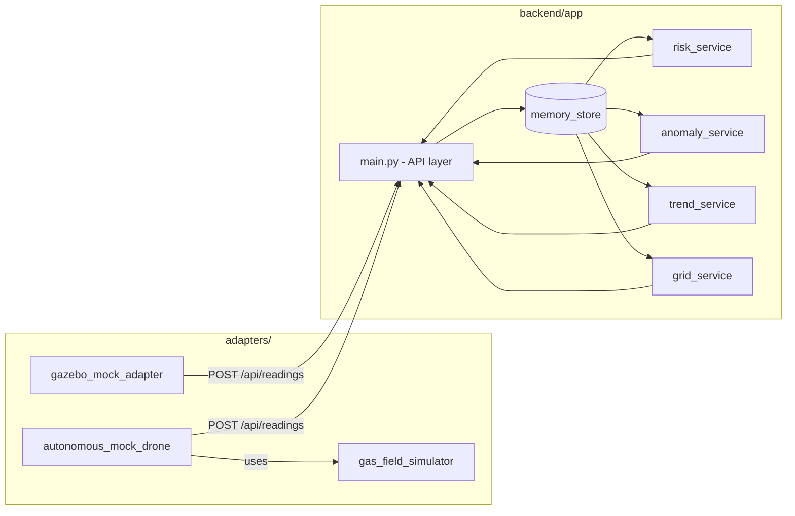

# Mine Drone Risk

A FastAPI backend prototype for underground mine safety monitoring: it
ingests gas sensor readings (CH4, CO, CO2, O2) and 3D LiDAR/position data
from drones or fixed sensor boxes, and turns them into a rule-based risk
score, anomaly events, and a 3D risk map. It is a research/decision-support
prototype, **not** a certified industrial gas safety system.

## Architecture



See [docs/architecture.md](docs/architecture.md) for a layer-by-layer
description, and [docs/api_contract.md](docs/api_contract.md) for the full
request/response schema of every endpoint.

## Sourced Thresholds vs. Heuristic Coefficients

The most important design decision in this codebase lives in
[`backend/app/services/thresholds.py`](backend/app/services/thresholds.py):
it deliberately keeps two very different kinds of numbers apart.

1. **Sourced safety thresholds** - trigger points taken directly from
   regulatory/authoritative documents, each carrying its citation:
   - MSHA 30 CFR 75.323 (methane action/withdrawal/bleeder limits, LEL)
   - MSHA 30 CFR 75.321 (CO2 mine-atmosphere limits, O2 minimum)
   - NIOSH Pocket Guide / IDLH docs and OSHA PEL Table Z-1 (CO, CO2
     occupational exposure limits)
   - OSHA 1910.134 guidance (oxygen-deficient atmosphere)

2. **Heuristic/prototype coefficients** - the risk-score weights
   (`SCORE_WEIGHTS`), risk-level cutoffs (`RISK_LEVEL_CUTOFFS`), trend
   rate limits (`TREND_RATE_LIMITS`), and spatial/LiDAR distances. These
   have **no regulatory source** - they are this prototype's own scoring
   design and are explicitly marked `HEURISTIC/PROTOTYPE` in the code.

The point of the split: a reviewer can trust the *trigger points* (they're
traceable to a regulation) without mistaking the *scoring/weighting scheme*
built on top of them for anything more than an engineering judgment call.
Mixing the two - e.g. presenting a weighted 0-100 score as if it were itself
a regulatory figure - would misrepresent what the system actually knows.

## Quickstart

```bash
pip install -r requirements.txt
uvicorn backend.app.main:app --reload
```

The API is then available at `http://127.0.0.1:8000`, with interactive docs
at `http://127.0.0.1:8000/docs`.

Run the test suite:

```bash
pytest
```

Optionally, feed it simulated readings with one of the adapters (from the
`adapters/` directory, with the backend running):

```bash
python adapters/gazebo_mock_adapter.py
```

## API summary

Full schemas and examples: [docs/api_contract.md](docs/api_contract.md).

| Method | Path | Purpose |
|---|---|---|
| GET | `/health` | Liveness check |
| POST | `/api/readings` | Save a sensor reading |
| GET | `/api/readings` | List latest readings |
| GET | `/api/readings/{drone_id}` | List latest readings for one drone |
| POST | `/api/drone/status` | Update a drone/platform status |
| GET | `/api/drone/status/{drone_id}` | Get status for one drone |
| GET | `/api/drones/statuses` | Get status for all drones |
| GET | `/api/risk/current` | Rule-based risk score for the latest reading |
| GET | `/api/risk/trend` | Temporal gas-trend analysis |
| GET | `/api/risk/map3d` | 3D grid of per-cell risk summaries |
| GET | `/api/risk/zones` | Grid cells at/above the risk-zone threshold |
| GET | `/api/anomalies` | Threshold-crossing / gradient anomaly events |

## Example flow: POST a reading, then read the risk

```bash
curl -X POST http://127.0.0.1:8000/api/readings \
  -H "Content-Type: application/json" \
  -d '{
    "timestamp": "2026-01-01T00:00:00Z",
    "drone_id": "drone-1",
    "source": "mock",
    "position": {"x": 10.0, "y": 5.0, "z": 2.2},
    "gas": {"ch4_ppm": 11000.0, "co_ppm": 60.0, "co2_ppm": 600.0, "o2_percent": 20.5},
    "lidar": {
      "min_distance": 1.5, "front_distance": 2.0, "left_distance": 2.0,
      "right_distance": 2.0, "ceiling_distance": 1.8, "floor_distance": 2.0,
      "obstacle_density": 0.1
    }
  }'

curl http://127.0.0.1:8000/api/risk/current
```

`GET /api/risk/current` then returns (trimmed for readability):

```json
{
  "message": "risk_calculated",
  "risk": {
    "risk_score": 42.0,
    "risk_level": "medium",
    "alarm_level": "warning",
    "safety_status": "safe",
    "recommended_action": "increase_sampling_frequency",
    "reasons": [
      "CH4 at/above MSHA action level (1.0 % v/v, 30 CFR 75.323)",
      "CO at/above OSHA PEL 8-h TWA (50 ppm, exposure limit)",
      "Methane accumulation risk in upper tunnel volume"
    ],
    "score_breakdown": {
      "ch4_score": 20, "co_score": 12, "co2_score": 0.0, "o2_score": 0.0,
      "combo_score": 0.0, "spatial_score": 10.0, "lidar_score": 0.0, "trend_score": 0.0
    }
  }
}
```

The 42.0 score is the sum of the CH4-action-level trigger (20), the
CO-PEL trigger (12), and the upper-tunnel-methane spatial bonus (10) - each
traceable back to a line in `thresholds.py` and `risk_service.py`.

## Design Choices

- **In-memory store, not a database.** `backend/app/storage/memory_store.py`
  keeps readings and drone statuses in process memory (a capped list and a
  dict). This keeps the prototype dependency-free and easy to run, at the
  cost of losing all data on restart - see Known Limitations.
- **Rule-based scoring, not ML.** Risk is computed from explicit,
  citable thresholds and fixed weights (see the Sourced vs. Heuristic
  section above), not a trained model. For a safety-adjacent prototype this
  keeps every score explainable ("why is this 42?" has a literal answer in
  `score_breakdown` and `reasons`) instead of opaque.
- **Temporal vs. spatial anomaly separation.** `anomaly_service.py`
  classifies a pair of readings as a *temporal* change (same physical spot,
  values changing over time - e.g. a leak building up) or a *spatial
  gradient* (a moving drone crossing into a different gas concentration).
  These call for different responses (a temporal spike suggests a real
  event; a spatial gradient may just mean the drone entered a naturally
  gassier area), so they're scored with different rate/gradient thresholds
  (`TEMPORAL_MAX_DISTANCE_M` decides which bucket a pair falls into).
- **Three adapters instead of one.** `gazebo_mock_adapter.py` and
  `autonomous_mock_drone.py` simulate two different data-generation styles
  (a simple point-source model vs. a fuller route-based mock with LiDAR/IMU/
  environment), and the `source` field (`gazebo` / `esp32` / `mock`) keeps
  the door open for a real ESP32 hardware sensor box without changing the
  API or scoring logic - the backend only ever depends on the shared
  `SensorReading` shape, not on which adapter produced it.

## Known Limitations & Future Work

Honest gaps, not hidden ones:

- **No persistent storage.** Everything lives in an in-process Python list/
  dict (`memory_store.py`). Restarting the process discards all readings,
  drone statuses, and history. There is no database, no write-ahead log, no
  backup.
- **No authentication or authorization.** Every endpoint is open. Anyone who
  can reach the process can post readings or read risk data.
- **No real hardware has been tested.** `"esp32"` exists as a valid `source`
  value and gets a small amount of special handling in
  `anomaly_service.classify_event_context`, but there is no ESP32 adapter
  script, and no real sensor hardware has been connected or validated
  against this backend.
- **Only simulation data has exercised this system.** All scoring, anomaly
  detection, and grid logic have been run against `gazebo_mock_adapter.py`
  and `autonomous_mock_drone.py` synthetic data (and the pytest suite in
  `tests/`) - not against real mine-gas field data.
- **No concurrency/multi-process safety.** `MemoryStore` is a plain Python
  object with no locking; running multiple backend workers/processes would
  give each one its own independent, inconsistent store.
- **The heuristic coefficients are unvalidated.** `SCORE_WEIGHTS`,
  `RISK_LEVEL_CUTOFFS`, and `TREND_RATE_LIMITS` are engineering judgment
  calls (explicitly marked `HEURISTIC/PROTOTYPE` in `thresholds.py`), not
  numbers derived from incident data or domain-expert calibration.

Future work that would be needed before any real deployment: persistent
storage, auth, real-hardware validation, and calibration/validation of the
heuristic coefficients against real or expert-reviewed data.
